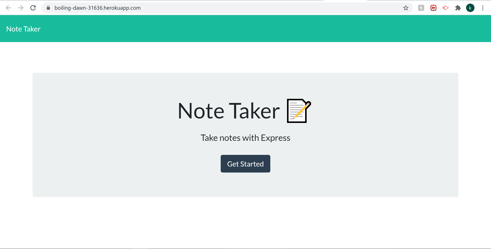
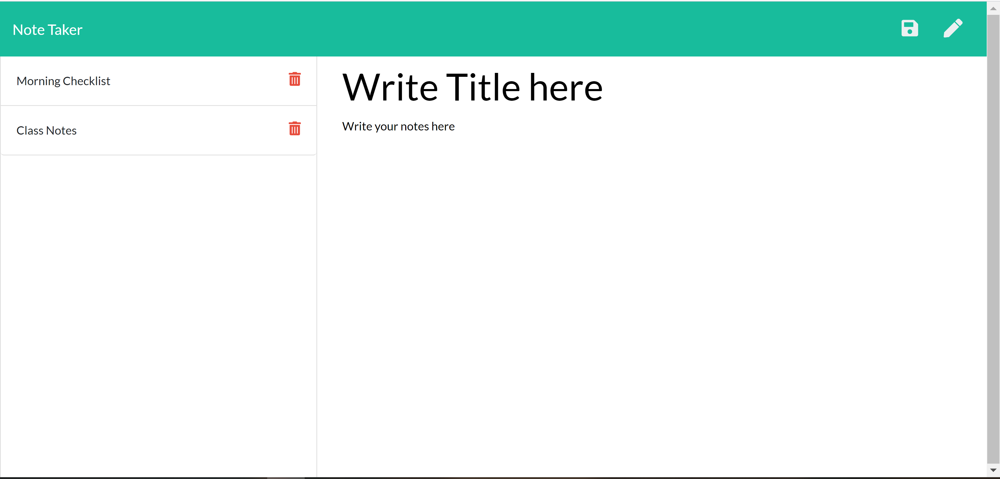

# Note Taker 

This project lets you take notes on the site for the times you need to write something down on the go. A simple to use UI that will save your notes for you after saving them. After getting started on the home page you can write down the title for your note and then the content right underneath it. Once done, the save button will pop up and you can save it and view it on the sidebar to the left. 

Front end code was provided while the back end was written by me.

Try out the project here: https://boiling-dawn-31636.herokuapp.com/